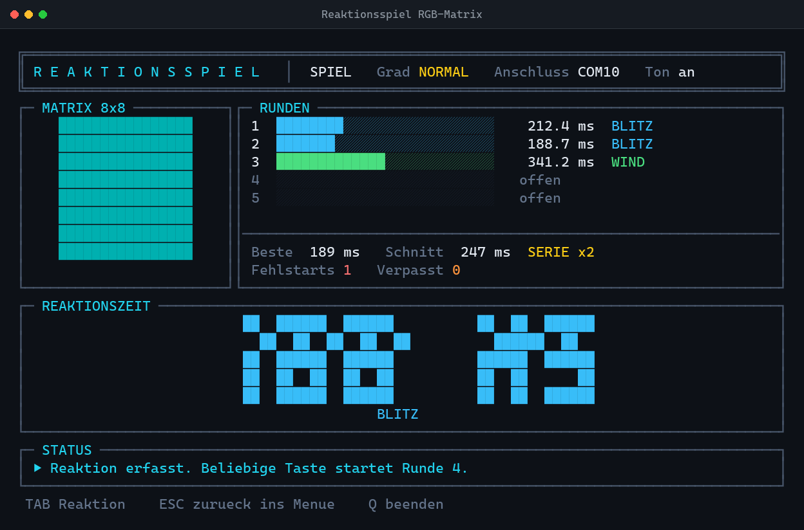
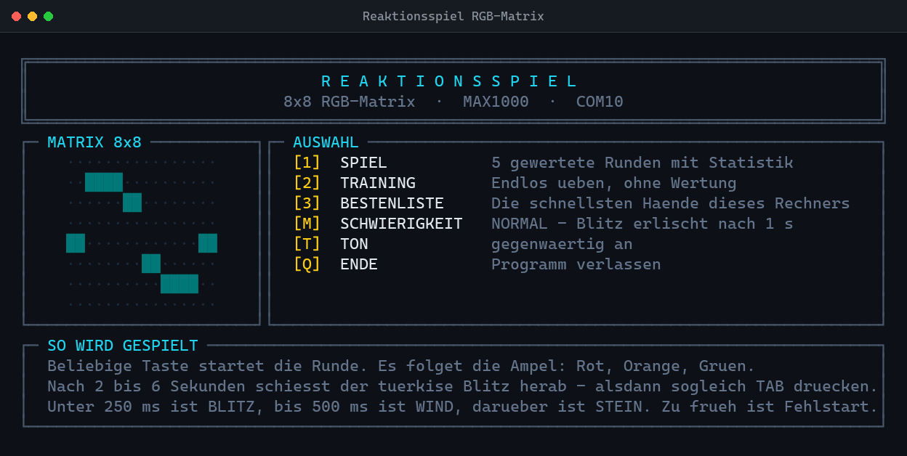
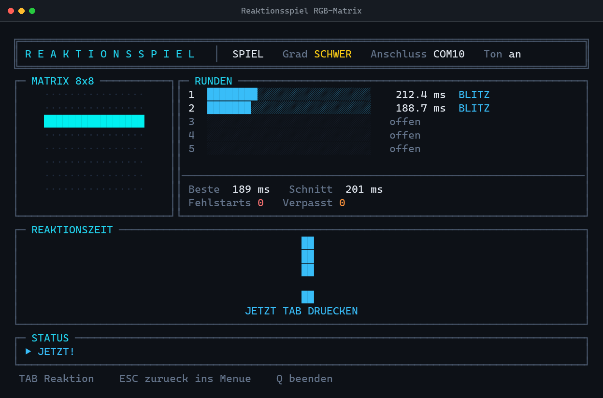

# SinusOfReaction

**A reaction-time game that lives on an 8×8 RGB matrix — and mirrors itself into your terminal, pixel for pixel.**



A sine wave breathes across the LED matrix while the game waits. You hit a key,
a traffic light counts down, everything goes dark — and somewhere between two
and six seconds later a turquoise bolt shoots down the matrix. Hit `TAB`. Your
reaction time is measured in milliseconds, scored, and stacked into a table.

Built for the Altera **MAX1000** FPGA driving a **DIGI-DOT 8×8 panel** over UART
at 921 600 baud. **No hardware? It runs anyway** — the terminal mirror renders
all 64 pixels in true color, so the entire game is playable on any Windows
console.



## Features

- **Live matrix mirror** — every LED rendered in the terminal in true color,
  so you can play by looking at either the hardware or the screen
- **Big-digit display** — counts your milliseconds up from zero with an eased
  animation while the matrix pulses in your score color
- **Three difficulty levels** — `LEICHT` keeps the bolt lit until you react,
  `NORMAL` kills it after one second, `SCHWER` flashes it for just 150 ms *and*
  throws in red **decoy flashes** you must not hit
- **Streak counter** — consecutive sub-250 ms hits build a streak
- **Persistent high-score table** — arcade-style name entry in giant letters,
  stored as JSON next to the game
- **Training mode** — endless unscored rounds
- **Sound cues** on the countdown, false starts and results — never on the
  bolt itself, because ears beat eyes and that would corrupt the measurement
- **Runs with or without the FPGA board**

## Scoring

| Time | Verdict |
| --- | --- |
| under 250 ms | `BLITZ` (lightning) |
| 250 – 500 ms | `WIND` |
| over 500 ms | `STEIN` (stone) |

A key pressed **before** the bolt is a false start: red blink, round repeats,
nothing scored. No reaction within 5 seconds counts as missed.



## Run it

Requires Python 3.8+ and [pyserial](https://pypi.org/project/pyserial/).
Windows only — keyboard polling uses `msvcrt`.

```bash
pip install pyserial
python reaktionsspiel.py
```

| Command | What it does |
| --- | --- |
| `python reaktionsspiel.py` | uses `COM10` (MAX1000 FTDI channel B) |
| `python reaktionsspiel.py COM9` | any other port |
| `python reaktionsspiel.py SIM` | force simulation, no hardware |

If the port cannot be opened, the game falls back to simulation on its own and
tells you why. On Windows you can also just double-click
`start_reaktionsspiel.bat`.

> Needs a real console (cmd or PowerShell). Keyboard polling does not work
> inside a Jupyter notebook.

## Controls

| Key | Action |
| --- | --- |
| any key | start a round |
| `TAB` | react to the bolt |
| `ESC` | reset back to the menu |
| `Q` | quit |
| `1` `2` `3` | game · training · high scores |
| `M` `T` | cycle difficulty · toggle sound |

## Under the hood

**Timing.** The stopwatch starts the instant the first row of the bolt is
written to the wire — the timestamp is taken *before* any screen drawing, so
rendering never inflates your score. During measurement the game deliberately
draws nothing and polls the keyboard every 0.5 ms.

**Wire protocol.** Each frame is eight lines of `<rr` + 24 hex bytes + `>`,
sent at 921 600 baud. The panel is wired as a snake, so pixels are remapped
through a lookup table and transmitted green-red-blue.

**Not hanging.** Console quick-edit mode is switched off at startup (a stray
mouse click otherwise freezes the whole program — the classic phantom
"crash"), serial writes carry a one-second timeout, waiting for a reaction is
capped, and the keyboard buffer is flushed at every phase change so a mashed
key never leaks into the next round. Box-drawing characters fall back to ASCII
if the output encoding cannot handle them.

**One file.** The whole game is a single ~2300-line Python file, sectioned and
documented throughout.

## A note on language

The game interface and all source comments are in **German** — it started as a
personal embedded-systems project. The code is heavily documented if you want
to read along.

---

© 2026 [goallthepath](https://github.com/goallthepath) · built for the joy of
making LEDs do something useful
